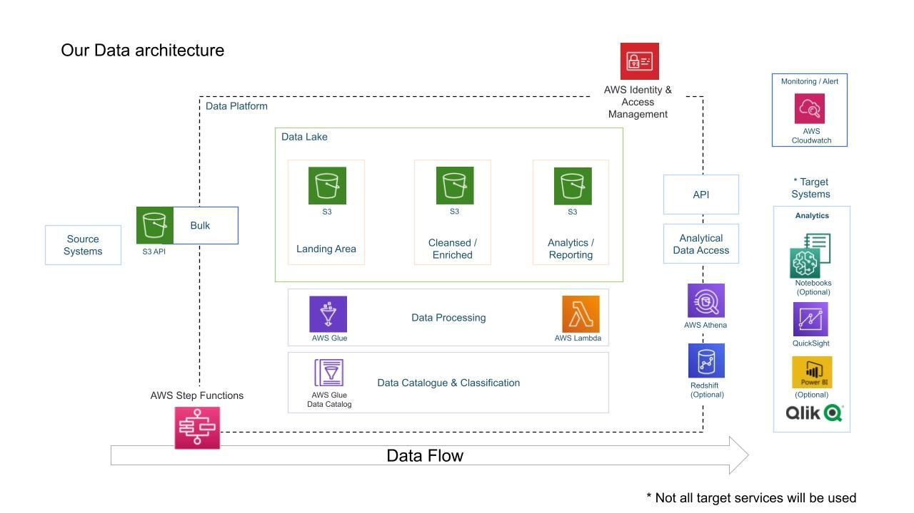

# ViralLens — YouTube Trending Analytics Pipeline

## Overview

ViralLens is a data analytics pipeline designed to process and analyze YouTube trending video datasets to uncover patterns behind viral content. The project ingests video metadata such as views, likes, comments, categories, and publishing times to identify factors that influence content popularity and engagement across different regions.
________________________________________
## Project Goals

1. Data Ingestion — Build a mechanism to ingest data from different sources
3. ETL System — We are getting data in raw format, transforming this data into the proper format
4. Data lake — We will be getting data from multiple sources so we need centralized repo to store them
5. Scalability — As the size of our data increases, we need to make sure our system scales with it
6. Cloud — We can’t process vast amounts of data on our local computer so we need to use the cloud, in this case, we will use AWS
7. Reporting — Build a dashboard to get answers to the question we asked earlier
________________________________________
## Services we will be using

1. Amazon S3: Amazon S3 is an object storage service that provides manufacturing scalability, data availability, security, and performance.
2. AWS IAM: This is nothing but identity and access management which enables us to manage access to AWS services and resources securely.
3. QuickSight: Amazon QuickSight is a scalable, serverless, embeddable, machine learning-powered business intelligence (BI) service built for the cloud.
4. AWS Glue: A serverless data integration service that makes it easy to discover, prepare, and combine data for analytics, machine learning, and application development.
5. AWS Lambda: Lambda is a computing service that allows programmers to run code without creating or managing servers.
6. AWS Athena: Athena is an interactive query service for S3 in which there is no need to load data it stays in S3.
________________________________________
## Dataset Used

This Kaggle dataset contains statistics (CSV files) on daily popular YouTube videos over the course of many months. There are up to 200 trending videos published every day for many locations. The data for each region is in its own file. The video title, channel title, publication time, tags, views, likes and dislikes, description, and comment count are among the items included in the data. A category_id field, which differs by area, is also included in the JSON file linked to the region.

https://www.kaggle.com/datasets/datasnaek/youtube-new
________________________________________
## Architecture Diagram

________________________________________
## Key Questions

•	What factors contribute to a video becoming trending on YouTube?

•	Which content categories generate the highest engagement?

•	How do views, likes, and comments correlate with trending status?

•	Are there specific publishing times that increase the likelihood of a video trending?

•	How do trending patterns vary across different regions and categories?
________________________________________
## Approach

•	Data Ingestion: Import YouTube trending datasets containing video metadata including views, likes, comments, and category information.

•	Data Cleaning: Handle missing values, remove duplicates, and standardize categorical variables such as video categories and regions.

•	Feature Engineering: Create engagement metrics such as like-to-view ratios, comment density, and popularity scores.

•	Aggregation & Analysis: Analyze trends by category, region, and publishing time to detect viral patterns.

•	Visualization: Build dashboards and charts to visualize engagement trends and identify high-performing content categories.
________________________________________
## Insights & Impact

•	Identified content categories that consistently dominate trending lists.

•	Revealed strong correlations between engagement metrics and video popularity.

•	Highlighted optimal publishing windows that increase visibility and reach.

•	Showed regional differences in trending content preferences.

•	Demonstrated how data pipelines can support content strategy and digital marketing analytics.
________________________________________
## Tools and Techniques

•	Languages: Python, SQL

•	Data Processing: Pandas, NumPy

•	Data Analysis: Exploratory Data Analysis (EDA), statistical aggregation

•	Data Storage: Structured datasets / relational databases

•	Visualization: Power BI / Tableau / Matplotlib / Seaborn

•	Techniques: Engagement metric engineering, trend analysis, content analytics

